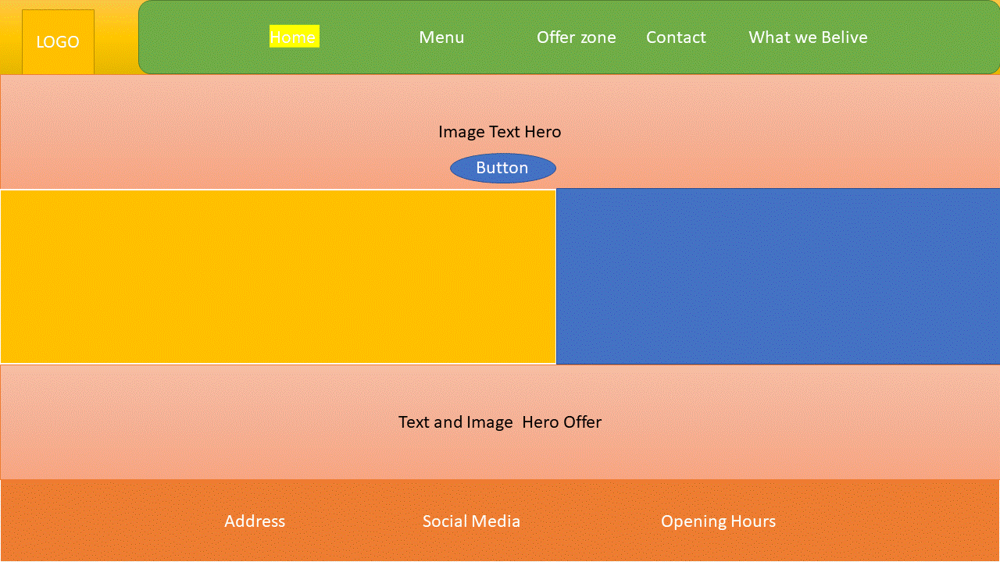
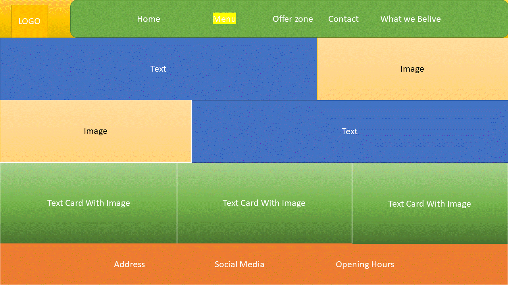
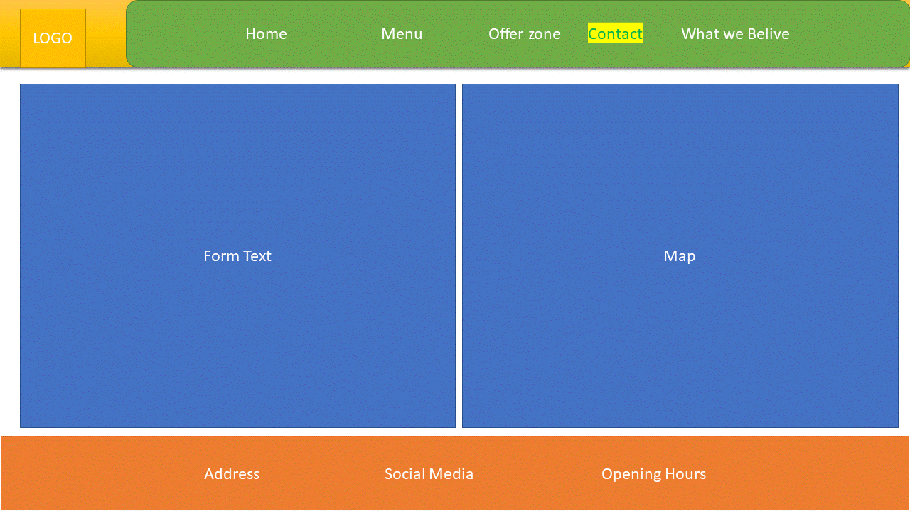
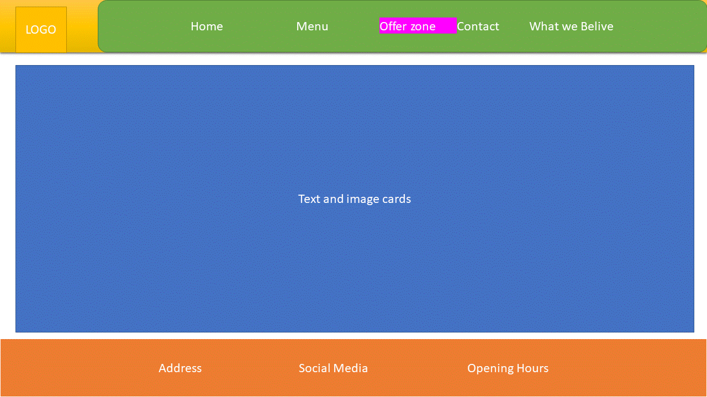

# K&H Diner - First Mile Stone Project

## PROJECT PURPOSE

This website present a work done for first milestone project , web site is for a restaurant K&H Diner Provide user information regarding different service of restaurant , it shall demonstrate my skill in usage of HTML & CSS
## Website Requirement 

### User Stories 
User should be able to navigate in website with ease and wondering where to look, all option should be visible and communicate it’s purpose.
•	User want to know about company
•	User want to know what food does restaurant offer
•	User want to know where to find restaurant, 
•	User want to do booking, complain or give suggestions.
•	User want to know about company’s beliefs and contribution to society .
•	User want to know about restaurant working hours.
•	User want to work with company.

### UX
Website shall contain 5 page which represent 7 section of website
1.	Header: Fix Navigation Bar shows different link for navigate in website.
2.	Home (Index.html) : Basic information about company , some highlight about menu and offer
3.	Menu (menu.html): Information about the Food Menu.
4.	Offer zone (offerzone.html): Information About offers
5.	Contact (contact.html): Web inquiry form & Location Map(Google Map)
6.	What We Believe (believe.html):Information About company values & what there customer & Employee think about company
7.	Footer: information about Address , opening Hours, Social media Links And version.

### Wireframe 
   
   
   
   

### Current Features

- website provide Information About The Menu
- It Have Offer Zone where User Can find out about different Offers
- Contact page have form which can be used for Booking, and complain, suggestions
- Also Having map which give location of store.
- on home page it have motivating section which will motivate user to navigate in offer zone and explore the menu.

### Features Left to Implement:

Planning to implement following Features

-online food ordering
-online payment
-Improvement In booking System.

## Technologies Used:

Project Made Using following tech.

### Bootstrap v 4.3.1
Bootstrap is used for following component.
1.	Grid Layout
2.	Navbar
3.	Card Columns 
4.	Form

### Font Awesome v 5.11.2
https://fontawesome.com/icons
font awesome used for Social Media & Menu Icons
1.	Facebook
2.	You tube
3.	Twitter

### Google Font 
- https://fonts.google.com/specimen/McLaren
- font-family: 'McLaren', cursive;

### AWS
- Project Developed in AWS Cloud 9 Environment.

### Logo Maker
- https://logomakr.com/

### Favicon Generator
- https://www.favicon-generator.org/
 

## Testing
### Tools
Testing is Done on following Devices/Browsers
- Desktop 
   - Chrome
   - Mozilla
   - Safari
- Iphone X
- Huawei p9 lite

### Testing Screenshot
### Function Testing
- Test: fix Navbar Navigation
   1. Open website
   2. Click on Home Link
   3. Click on Menu Link see if Nav bar is in fix position.
   4. Click on Offer Zone link see if page load
   5. Click on Contact link see if page load
   6. Click on What We Believe link see if page load
   
 - Test: Social Media Link
   1. Scroll down To Footer
   2. Click on Social Media icon Facebook , YouTube , Twitter 
   3. See if relevant page load in different tab on click.
   
 - Test: Write To Us Form
   - Test: Form Validator 
    1. Click on submit button.
    2. See if text appears “Field Required “ ( Valid Email, Comment,
    3. Try to fill valid Details and then Submit again.
  - Test: Map Working
    1. See if map Load 
    2. Click on Map See if it open in different tab.
  - Test: Animation on Home Page
   1. Move Mouse on different links in Navbar.
   2. On Hover Background of Link And Font color Should change.
   3. On Home Page  “Check Menu now “ should have aura effect and should blink.
   4. On Home Page “Are you ready for Halloween fest should have blink effect”

## Deployment

This Website is Deployed on GitHub Pages. And deployed using AWS Cloud 9 using terminal window to Github.

### Deployment Steps

1.	In terminal window use (git add.) command  to add files to the directory
2.	Use ( git commit -m “ text” ) and commit the changes and updates 
3.	Then to deployment (git Push) Command to push the files to the GitHub pages.

All version are in master branch

## Credits

### Media
All Images are used from Adobe Stock free license version.
### Content
For Menu Content inspiration took from Wendy’s , Burger king, Mc Donald’s 
### Acknowledgement 
Acknowledgment to following in this project

-Rahul Patil
-https://css-tricks.com/
-https://www.w3schools.com/

